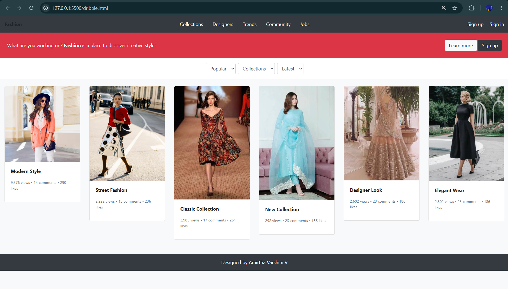

# Ex.No:08 Responsive Web Design using Bootstrap
# Date:29.08.2026
# AIM:
To create a simplified clone of Dribbble (https://dribbble.com/) landing page.

# DESIGN STEPS:
## Step 1:
Clone the repository from GitHub.

## Step 2:
Create Django Admin project.

## Step 3:
Create a New App under the Django Admin project.

## Step 4:
Insert the necessary CSS and JavaScript files as external in order to use Bootstrap.

## Step 5:
Create a HTML file and include the needed Bootstrap components.

## Step 6:
Publish the website in the LocalHost.

# PROGRAM :
html:
```
<html>
<head>
  <title>Fashion Shots</title>
  <link rel="stylesheet" href="https://stackpath.bootstrapcdn.com/bootstrap/4.5.2/css/bootstrap.min.css">
</head>
<body class="bg-light">

  <header class="navbar navbar-dark bg-dark">
    <div class="logo font-weight-bold">Fashion</div>
    <nav>
      <ul class="nav">
        <li class="nav-item"><a class="nav-link text-white" href="#">Collections</a></li>
        <li class="nav-item"><a class="nav-link text-white" href="#">Designers</a></li>
        <li class="nav-item"><a class="nav-link text-white" href="#">Trends</a></li>
        <li class="nav-item"><a class="nav-link text-white" href="#">Community</a></li>
        <li class="nav-item"><a class="nav-link text-white" href="#">Jobs</a></li>
      </ul>
    </nav>
    <div>
      <a class="text-white mr-3" href="#">Sign up</a>
      <a class="text-white" href="#">Sign in</a>
    </div>
  </header>

  <section class="bg-danger text-white p-4 d-flex justify-content-between align-items-center flex-wrap">
    <p class="mb-0">What are you working on? <strong>Fashion</strong> is a place to discover creative styles.</p>
    <div>
      <button class="btn btn-light">Learn more</button>
      <button class="btn btn-dark">Sign up</button>
    </div>
  </section>

  <section class="bg-white p-3 d-flex justify-content-center">
    <select class="form-control w-auto mr-2">
      <option>Popular</option>
    </select>
    <select class="form-control w-auto mr-2">
      <option>Collections</option>
    </select>
    <select class="form-control w-auto">
      <option>Latest</option>
    </select>
  </section>

  <main class="container-fluid bg-light py-4">
    <div class="row">

      <div class="col-lg-2 col-md-4 col-sm-6 mb-4">
        <div class="card">
          
          <div class="card-body">
            <p class="font-weight-bold">Modern Style</p>
            <p class="small text-muted">9,876 views • 14 comments • 290 likes</p>
          </div>
        </div>
      </div>

      <div class="col-lg-2 col-md-4 col-sm-6 mb-4">
        <div class="card">
          
          <div class="card-body">
            <p class="font-weight-bold">Street Fashion</p>
            <p class="small text-muted">2,222 views • 13 comments • 236 likes</p>
          </div>
        </div>
      </div>

      <div class="col-lg-2 col-md-4 col-sm-6 mb-4">
        <div class="card">
          
          <div class="card-body">
            <p class="font-weight-bold">Classic Collection</p>
            <p class="small text-muted">3,985 views • 17 comments • 264 likes</p>
          </div>
        </div>
      </div>

      <div class="col-lg-2 col-md-4 col-sm-6 mb-4">
        <div class="card">
          
          <div class="card-body">
            <p class="font-weight-bold">New Collection</p>
            <p class="small text-muted">292 views • 23 comments • 186 likes</p>
          </div>
        </div>
      </div>

      <div class="col-lg-2 col-md-4 col-sm-6 mb-4">
        <div class="card">
          
          <div class="card-body">
            <p class="font-weight-bold">Designer Look</p>
            <p class="small text-muted">2,602 views • 23 comments • 186 likes</p>
          </div>
        </div>
      </div>

      <div class="col-lg-2 col-md-4 col-sm-6 mb-4">
        <div class="card">
          
          <div class="card-body">
            <p class="font-weight-bold">Elegant Wear</p>
            <p class="small text-muted">2,602 views • 23 comments • 186 likes</p>
          </div>
        </div>
      </div>

    </div>
  </main>

  <footer class="bg-dark text-white text-center p-3">
    Designed by Amirtha Varshini V
  </footer>

</body>
</html>
```
# OUTPUT:



# RESULT:
The Project for responsive web design using Bootstrap is completed successfully.
